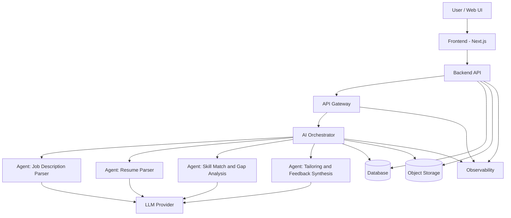

# 🤖 Job Application AI Copilot

An **AI-powered job application assistant** designed to help candidates tailor resumes, generate role-specific feedback, and reason about job fit using **agentic AI pipelines** and **scalable backend services**.

This project focuses on **production-ready applied AI**, emphasizing reliability, observability, and clean backend architecture rather than one-off LLM demos.

---

## ✨ Key Features

- **Resume Tailoring Engine**
  - Adapts resumes to specific job descriptions while preserving factual consistency
  - Highlights role-relevant skills, projects, and experiences

- **Agentic AI Pipelines**
  - Multi-agent workflow for parsing job descriptions, analyzing resumes, and generating feedback
  - Agents collaborate through structured prompts and intermediate reasoning steps

- **Explainable Feedback**
  - Provides actionable insights instead of opaque rewrites
  - Surfaces gaps, strengths, and suggested improvements aligned with job requirements

- **Scalable Backend Architecture**
  - Stateless API services designed for concurrent usage
  - Serverless components for burst workloads and cost efficiency

---

## 🏗️ System Architecture


### Core Components

- **API Layer**
  - RESTful endpoints for resume upload, job parsing, and feedback generation
  - Input validation, request tracing, and structured error handling

- **AI Orchestration**
  - LangChain-based pipelines coordinating multiple agents
  - Prompt versioning and controlled context windows
  - Deterministic outputs for reproducibility

- **Persistence**
  - DynamoDB for storing resume metadata, analysis outputs, and user sessions
  - Designed for low-latency reads and scalable writes

- **Serverless Execution**
  - AWS Lambda for compute-intensive or burst workloads
  - S3 for document storage and intermediate artifacts

---

## 🧠 AI Design Philosophy

This project treats LLMs as **components within a system**, not the system itself.

Key principles:
- **Bounded reasoning** over free-form generation
- **Prompt versioning** and regression safety
- **Failure-aware pipelines** with graceful degradation
- **Explainability over blind automation**

---

## 🛠️ Tech Stack

**Languages**
- TypeScript, Python

**Backend & APIs**
- FastAPI
- RESTful API design
- LangChain (agent orchestration)

**Cloud & Infrastructure**
- AWS Lambda
- API Gateway
- DynamoDB
- S3

**AI & ML**
- OpenAI API
- Hugging Face models
- Prompt engineering & agent workflows

**Dev & Tooling**
- Docker
- GitHub Actions
- Structured logging & monitoring

---

## 🚀 Getting Started

### Prerequisites
- Python 3.10+
- Node.js 18+
- AWS account (for serverless deployment)
- OpenAI API key


## ▶️ Run Locally

This repository contains everything needed to run the application locally.

🔗 **View the version of the app in AI Studio:**  
https://ai.studio/apps/drive/1FufZXuijAvVLPxeoO5OUdjKd5302jA47

### Clone the Repository
```bash
git clone https://github.com/your-username/job-application-ai-copilot.git
cd job-application-ai-copilot


